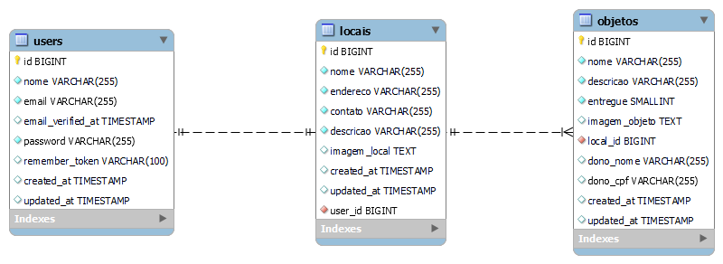

# Desafio: Achados e Perdidos

  

  Achados e Perdidos by <a href="https://github.com/treinaweb">TreinaWeb</a>

## Índice

- [Descrição](#descrição)
- [Requisitos](#requisitos)
- [Diagrama de caso de uso](#diagrama-de-casos-de-uso)
- [Diagrama do banco de dados](#diagrama-do-banco-de-dados)

## Descrição

Permitir que pessoas encontrem seus objetos perdidos de maneira mais fácil, além de facilitar a vida de pessoas responsáveis por comércios, condomínios e outro tipo de locais públicos que possuem sala de Achados e Perdidos.

## Requisitos

- [Requisitos do usuário](./requisitos/requisitos-usuario.md)
- [Requisitos Funcionais](./requisitos/requisitos-funcionais.md)
- [Requisitos Não Funcionais](./requisitos/requisitos-nao-funcionais.md)

## Diagrama de casos de uso

A aplicação possui dois atores, o dono do objeto e o administrador do departamento de achados e perdidos. O diagrama abaixo demonstra quais ações cada um dos atores pode realizar.

## Diagrama do banco de dados

A aplicação terá três tabelas que irão se relacionar entre si, sendo elas as tabelas `users`, `locais` e `objetos`. No diagrama abaixo é possível ver os detalhes de cada uma dessas tabelas e como as mesmas se relacionam.

## Casos de Uso

Abaixo pode ser encontrada uma descrição textual mais detalhada sobre cada um casos de uso exitentes na aplicação.

- [Casos de Uso](./casos-de-uso/casos-de-uso.md)